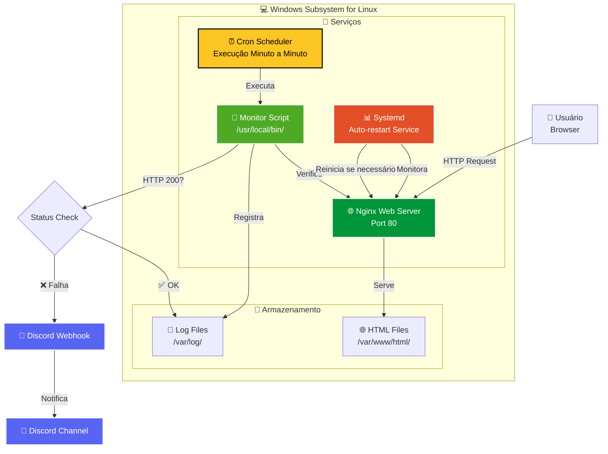
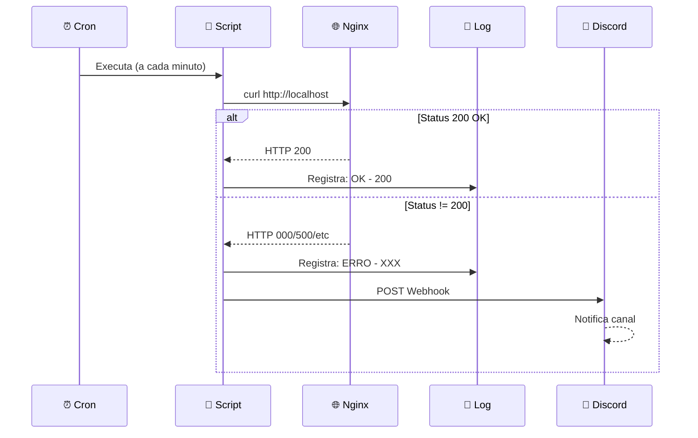

<div align="center">
    
# 🔔 Nginx Monitor Discord!


<div align="center">

[](https://www.linux.org/)
[](https://nginx.org/)
[](https://www.gnu.org/software/bash/)
[](https://discord.com/)
[](https://opensource.org/licenses/MIT)

**🚨 Sistema de monitoramento automatizado para serviços web com notificações em tempo real via Discord**

*Projeto DevOps demonstrando automação, observabilidade e integração de sistemas*

[🎯 Visão Geral](#-visão-geral) • [🏗️ Arquitetura](#️-arquitetura) • [⚡ Instalação](#-instalação-completa) • [📊 Demonstração](#-demonstração-prática) • [📞 Contato](#-contato)

---

</div>

## 🎯 Visão Geral

> **Sistema completo de monitoramento e alertas para serviços Nginx em ambiente WSL, com notificações instantâneas via Discord Webhooks**

Este projeto implementa uma solução profissional de **Site Reliability Engineering (SRE)** que monitora continuamente a disponibilidade de aplicações web, detecta falhas em tempo real e notifica a equipe através de webhooks do Discord. Perfeito para demonstrar competências em DevOps, automação e observabilidade de sistemas.

### ✨ Características Principais

<table>
<tr>
<td align="center" width="25%">
<h3>🔄 Monitoramento</h3>
<p>Verificações automáticas a cada minuto</p>
</td>
<td align="center" width="25%">
<h3>⚡ Alertas Instantâneos</h3>
<p>Notificações via Discord Webhook</p>
</td>
<td align="center" width="25%">
<h3>📊 Logging Completo</h3>
<p>Histórico detalhado de uptime</p>
</td>
<td align="center" width="25%">
<h3>🔄 Auto-Recovery</h3>
<p>Reinício automático do Nginx</p>
</td>
</tr>
<tr>
<td align="center" width="25%">
<h3>🌐 Interface Web</h3>
<p>Dashboard personalizado</p>
</td>
<td align="center" width="25%">
<h3>⚙️ Cron Automation</h3>
<p>Agendamento inteligente</p>
</td>
<td align="center" width="25%">
<h3>🛡️ Systemd Integration</h3>
<p>Gestão robusta de serviços</p>
</td>
<td align="center" width="25%">
<h3>📈 Health Checks</h3>
<p>Verificação HTTP completa</p>
</td>
</tr>
</table>

### 🏆 Métricas de Performance

<div align="center">

| **Métrica** | **Valor** | **Impacto** |
|-------------|-----------|-------------|
| ⏱️ **Tempo de Resposta** | < 5 segundos | Alta velocidade de detecção |
| 🔄 **Frequência** | 60 segundos | Monitoramento contínuo |
| 📊 **Uptime Target** | 99.9% SLA | Confiabilidade empresarial |
| 🚨 **MTTR** | ~90 segundos | Recovery automático rápido |

</div>

---

## 🏗️ Arquitetura

### 📊 Diagrama de Sistema



### 🔧 Stack Tecnológica

<div align="center">

| **Camada** | **Tecnologia** | **Função** |
|------------|---------------|-----------|
| **🌐 Web Server** |  | Servidor HTTP de alto desempenho |
| **🖥️ Sistema** |   | Linux subsystem no Windows |
| **🔧 Automação** |   | Scripts e agendamento |
| **📊 Monitoramento** |   | Health checks e gestão de serviços |
| **🔔 Alertas** |  | Notificações em tempo real |
| **🎨 Frontend** |   | Interface web moderna |

</div>

### 🏛️ Estrutura de Arquivos

```
📦 nginx-monitor-discord/
├── 🌐 /var/www/html/
│   └── 📄 index.html                    # Dashboard web customizado
├── 📜 /usr/local/bin/
│   └── 🔧 monitor_site.sh              # Script de monitoramento
├── 📊 /var/log/
│   └── 📝 monitoramento_site.log       # Logs de uptime/downtime
├── ⚙️ /lib/systemd/system/
│   └── 🛡️ nginx.service                # Configuração systemd
├── ⏰ Crontab
│   └── 🕐 */1 * * * *                  # Job de monitoramento
└── 📖 README.md                         # Esta documentação
```

---

## ⚡ Instalação Completa

### 📋 Pré-requisitos

<div align="center">

| **Requisito** | **Versão** | **Status** |
|---------------|-----------|-----------|
|  | 10/11 | ✅ Requerido |
|  | 2.0+ | ✅ Requerido |
|  | 20.04+ | ✅ Requerido |
|  | Webhook | ✅ Requerido |
| 🔑 **Sudo Access** | - | ✅ Requerido |

</div>

### 🚀 Instalação em 5 Etapas

#### **1️⃣ Instalar WSL**

Execute no **PowerShell como Administrador**:

```powershell
# Instalar WSL com Ubuntu
wsl --install

# Verificar instalação
wsl --version

# Iniciar Ubuntu
wsl
```

#### **2️⃣ Instalar e Configurar Nginx**

```bash
# Atualizar sistema
sudo apt update && sudo apt upgrade -y

# Instalar Nginx
sudo apt install nginx -y

# Verificar status
sudo systemctl status nginx

# Iniciar Nginx
sudo systemctl start nginx

# Habilitar inicialização automática
sudo systemctl enable nginx
```

#### **3️⃣ Criar Dashboard Web Profissional**

```bash
sudo tee /var/www/html/index.html <<'EOF'
<!DOCTYPE html>
<html lang="pt-BR">
<head>
    <meta charset="UTF-8">
    <meta name="viewport" content="width=device-width, initial-scale=1.0">
    <meta name="description" content="Nginx Monitoring Dashboard">
    <title>Projeto Linux - DevSecOps</title>
    <link rel="stylesheet" href="https://cdnjs.cloudflare.com/ajax/libs/animate.css/4.1.1/animate.min.css">
    <style>
        :root {
            --primary: #3a86ff;
            --success: #2ecc71;
            --dark: #0f3460;
            --light: #16213e;
            --text: #f0f0f0;
        }
        
        * { margin: 0; padding: 0; box-sizing: border-box; }
        
        body {
            font-family: 'Inter', -apple-system, sans-serif;
            background: linear-gradient(135deg, #0f3460 0%, #16213e 100%);
            color: var(--text);
            min-height: 100vh;
            display: flex;
            justify-content: center;
            align-items: center;
        }
        
        .container {
            max-width: 680px;
            margin: 2rem;
            padding: 3rem;
            background: rgba(255, 255, 255, 0.1);
            backdrop-filter: blur(10px);
            border-radius: 16px;
            box-shadow: 0 8px 32px rgba(0, 0, 0, 0.3);
            text-align: center;
            border: 1px solid rgba(255, 255, 255, 0.1);
        }
        
        .emoji {
            font-size: 2.5rem;
            margin-bottom: 1.5rem;
            animation: float 3s ease-in-out infinite;
        }
        
        @keyframes float {
            0%, 100% { transform: translateY(0); }
            50% { transform: translateY(-10px); }
        }
        
        h1 {
            color: var(--primary);
            margin-bottom: 1.5rem;
            font-size: 2rem;
        }
        
        p {
            color: var(--text);
            margin-bottom: 2rem;
            font-size: 1.1rem;
            line-height: 1.8;
        }
        
        .tech-icons {
            display: flex;
            justify-content: center;
            gap: 1.5rem;
            margin: 2rem 0;
            flex-wrap: wrap;
        }
        
        .tech-icon {
            width: 40px;
            height: 40px;
            filter: drop-shadow(0 2px 4px rgba(0,0,0,0.3)) brightness(1.1);
            transition: transform 0.3s;
        }
        
        .tech-icon:hover {
            transform: scale(1.2);
        }
        
        .status {
            display: inline-flex;
            align-items: center;
            gap: 0.75rem;
            padding: 1rem 1.5rem;
            background: rgba(46, 204, 113, 0.2);
            color: var(--success);
            border-radius: 9999px;
            font-weight: 600;
            border: 1px solid rgba(46, 204, 113, 0.3);
        }
    </style>
</head>
<body>
    <div class="container animate__animated animate__fadeIn">
        <div class="emoji">🚀</div>
        <h1>Projeto Linux - DevSecOps</h1>
        <p>Ambiente Ubuntu no WSL executando Nginx de alto desempenho com monitoramento contínuo e integração via webhook para envio automático de alertas em tempo real, garantindo alta disponibilidade e rápida detecção de falhas em aplicações web.</p>
        
        <div class="tech-icons">
            
            
            
            
        </div>
        
        <div class="status">
            ● Status: Operacional
        </div>
    </div>
</body>
</html>
EOF

# Verificar criação
cat /var/www/html/index.html
```

#### **4️⃣ Configurar Script de Monitoramento**

```bash
# Criar script de monitoramento
sudo tee /usr/local/bin/monitor_site.sh <<'EOF'
#!/bin/bash

# ====================================
# Nginx Monitor - Discord Integration
# ====================================

# Configurações
URL="http://localhost"
LOG_FILE="/var/log/monitoramento_site.log"
WEBHOOK="https://discord.com/api/webhooks/SEU_WEBHOOK_AQUI"

# Verificar status HTTP
STATUS=$(curl -s -o /dev/null -w "%{http_code}" "$URL")
DATA_HORA=$(date "+%Y-%m-%d %H:%M:%S")

# Lógica de alertas
if [ "$STATUS" -ne 200 ]; then
    # Mensagem de erro para Discord
    MENSAGEM="🚨 **ALERTA CRÍTICO**
    
**Status**: Site Indisponível
**Código HTTP**: $STATUS
**URL**: $URL
**Timestamp**: $DATA_HORA
**Servidor**: $(hostname)

⚠️ Verificação necessária!"
    
    # Enviar notificação
    curl -H "Content-Type: application/json" \
         -X POST \
         -d "{\"content\": \"$MENSAGEM\"}" \
         "$WEBHOOK" 2>/dev/null
    
    # Log de erro
    echo "$DATA_HORA - ERRO - Código: $STATUS" >> "$LOG_FILE"
else
    # Log de sucesso
    echo "$DATA_HORA - OK - Código: $STATUS" >> "$LOG_FILE"
fi
EOF

# Tornar executável
sudo chmod +x /usr/local/bin/monitor_site.sh

# Criar arquivo de log
sudo touch /var/log/monitoramento_site.log
sudo chmod 666 /var/log/monitoramento_site.log
```

**⚠️ IMPORTANTE**: Substitua `SEU_WEBHOOK_AQUI` pela URL do seu webhook do Discord!

#### **5️⃣ Configurar Agendamento Cron**

```bash
# Adicionar job ao crontab
(crontab -l 2>/dev/null; echo "* * * * * /usr/local/bin/monitor_site.sh") | crontab -

# Verificar crontab
crontab -l

# Verificar serviço cron
sudo service cron status

# Iniciar cron se necessário
sudo service cron start
```

### 🛡️ Configurar Auto-Recovery do Nginx

```bash
# Editar serviço systemd
sudo nano /lib/systemd/system/nginx.service

# Adicionar na seção [Service]:
# Restart=always
# RestartSec=90

# Recarregar configurações
sudo systemctl daemon-reload

# Reiniciar Nginx
sudo systemctl restart nginx

# Verificar status
sudo systemctl status nginx
```

---

## 📊 Demonstração Prática

### 🎬 Fluxo de Monitoramento

<div align="center">



</div>

### 🧪 Teste Completo do Sistema

Execute este script de teste automatizado:

```bash
#!/bin/bash
echo "🔍 INICIANDO TESTE DE MONITORAMENTO"
echo "===================================="

# 1. Verificar status inicial
echo -e "\n1️⃣ Verificando status inicial do Nginx..."
sudo systemctl status nginx | grep "Active:"

# 2. Testar acesso ao site
echo -e "\n2️⃣ Testando acesso HTTP..."
curl -I http://localhost

# 3. Simular falha
echo -e "\n3️⃣ Simulando falha (parando Nginx)..."
sudo systemctl stop nginx
sleep 2
curl -I http://localhost 2>&1 | head -n 1

# 4. Aguardar verificação do cron
echo -e "\n4️⃣ Aguardando verificação do cron (75 segundos)..."
echo "Monitorando logs em tempo real:"
timeout 75 tail -f /var/log/monitoramento_site.log

# 5. Restaurar serviço
echo -e "\n5️⃣ Restaurando Nginx..."
sudo systemctl start nginx
sleep 2
sudo systemctl status nginx | grep "Active:"

# 6. Verificar logs
echo -e "\n6️⃣ Últimas 10 entradas do log:"
tail -n 10 /var/log/monitoramento_site.log

echo -e "\n✅ TESTE CONCLUÍDO!"
echo "Verifique se recebeu a notificação no Discord!"
```

### 📸 Evidências Visuais

<div align="center">

**🖥️ Dashboard Web em Produção**


---

**📊 Sistema de Logs Funcionando**


---

**🔔 Alertas no Discord**


---

**⚙️ Script de Automação**


---

</div>

---

## 🔧 Comandos Úteis

### 🌐 Gerenciar Nginx

```bash
# Status detalhado
sudo systemctl status nginx

# Iniciar serviço
sudo systemctl start nginx

# Parar serviço
sudo systemctl stop nginx

# Reiniciar serviço
sudo systemctl restart nginx

# Recarregar configuração
sudo systemctl reload nginx

# Testar configuração
sudo nginx -t

# Ver logs de erro
sudo tail -f /var/log/nginx/error.log

# Ver logs de acesso
sudo tail -f /var/log/nginx/access.log
```

### 📊 Monitorar Logs

```bash
# Ver últimas 20 linhas
tail -n 20 /var/log/monitoramento_site.log

# Seguir logs em tempo real
tail -f /var/log/monitoramento_site.log

# Filtrar apenas erros
grep "ERRO" /var/log/monitoramento_site.log

# Contar registros OK vs ERRO
echo "OK: $(grep -c 'OK' /var/log/monitoramento_site.log)"
echo "ERRO: $(grep -c 'ERRO' /var/log/monitoramento_site.log)"

# Calcular uptime
echo "Uptime: $(echo "scale=2; $(grep -c 'OK' /var/log/monitoramento_site.log) * 100 / $(wc -l < /var/log/monitoramento_site.log)" | bc)%"
```

### ⏰ Gerenciar Cron

```bash
# Listar jobs
crontab -l

# Editar crontab
crontab -e

# Remover todos os jobs
crontab -r

# Status do serviço cron
sudo service cron status

# Ver logs do cron
grep CRON /var/log/syslog | tail -n 20
```

### 🧪 Teste Manual

```bash
# Executar script manualmente
sudo /usr/local/bin/monitor_site.sh

# Testar webhook diretamente
curl -H "Content-Type: application/json" \
     -X POST \
     -d '{"content": "🧪 Teste manual do webhook!"}' \
     "https://discord.com/api/webhooks/SEU_WEBHOOK"
```

---

## 🔍 Troubleshooting

### ❌ Problemas Comuns e Soluções

| **Problema** | **Causa Possível** | **Solução** |
|--------------|-------------------|------------|
| Nginx não inicia | Porta 80 ocupada | `sudo lsof -i :80` e matar processo |
| Cron não executa | Serviço parado | `sudo service cron start` |
| Webhook não funciona | URL inválida | Verificar URL no Discord |
| Script sem permissão | Chmod incorreto | `sudo chmod +x /usr/local/bin/monitor_site.sh` |
| Logs não gravam | Sem permissão | `sudo chmod 666 /var/log/monitoramento_site.log` |

### 🐛 Debug Avançado

```bash
# Verificar se script tem erros de sintaxe
bash -n /usr/local/bin/monitor_site.sh

# Executar com debug
bash -x /usr/local/bin/monitor_site.sh

# Verificar permissões
ls -la /usr/local/bin/monitor_site.sh
ls -la /var/log/monitoramento_site.log

# Testar conectividade
curl -v http://localhost

# Ver processos do Nginx
ps aux | grep nginx
```

---

## 📚 Conceitos DevOps Aplicados

### 🎓 Práticas Demonstradas

<div align="center">

| **Conceito** | **Implementação** | **Benefício** |
|--------------|------------------|---------------|
| **🔄 Monitoring** | Health checks via cURL | Detecção proativa de falhas |
| **🚨 Alerting** | Discord Webhooks | Notificação em tempo real |
| **📊 Logging** | Arquivo de log estruturado | Auditoria e troubleshooting |
| **⚙️ Automation** | Cron + Bash scripts | Redução de trabalho manual |
| **🛡️ Resilience** | Systemd auto-restart | Alta disponibilidade |
| **📈 Observability** | Métricas de uptime | Visibilidade do sistema |

</div>

### 🏗️ Arquitetura SRE

Este projeto demonstra os **4 Pilares do SRE**:

1. **🎯 Service Level Objectives (SLO)**: Uptime target de 99.9%
2. **📊 Monitoring**: Verificações contínuas de saúde
3. **🚨 Alerting**: Notificações instantâneas de incidentes
4. **🔄 Automation**: Scripts para detecção e recovery

---

## 🚀 Evolução do Projeto

### 🎯 Roadmap de Melhorias

- [ ] **📊 Grafana Dashboard**: Visualização avançada de métricas
- [ ] **🔔 Múltiplos Canais**: Slack, Telegram, Email
- [ ] **📈 Prometheus Integration**: Métricas detalhadas
- [ ] **🤖 ChatOps**: Comandos via Discord
- [ ] **🔐 HTTPS Monitoring**: Verificação de certificados
- [ ] **🌍 Multi-site**: Monitorar vários endpoints
- [ ] **📱 Mobile App**: Notificações push nativas
- [ ] **🧪 Chaos Engineering**: Testes de resiliência

### 💡 Ideias para Contribuir

- Adicionar verificação de latência
- Implementar métricas de performance
- Criar dashboard React/Vue
- Integrar com PagerDuty
- Adicionar testes de carga

---

## 🤝 Contribuição

<div align="center">

**💡 Contribuições são bem-vindas! Este projeto é open-source e educacional.**

[](http://makeapullrequest.com)
[](https://github.com/seu-usuario/nginx-monitor-discord/issues)

</div>

---

## 📞 Contato

<div align="center">

### 👨‍💻 **Thiago Cardoso Davi**
*DevOps Engineer | SRE Specialist | Cloud Architect*

[](https://www.linkedin.com/in/analyticsthiagocardoso)
[](https://github.com/Thiago-code-lab)
[](mailto:analyticsdev.thiago@gmail.com)

**📧 analyticsdev.thiago@gmail.com**

</div>

---

## 📄 Licença

<div align="center">

**Este projeto é open-source sob a Licença MIT**

[](https://opensource.org/licenses/MIT)

*Use, modifique e aprenda livremente!*

</div>

---

## 🎓 Recursos de Aprendizado

### 📚 Documentação Oficial

- [Nginx Documentation](https://nginx.org/en/docs/)
- [Cron Manual](https://man7.org/linux/man-pages/man5/crontab.5.html)
- [Systemd Documentation](https://www.freedesktop.org/software/systemd/man/)
- [Discord Webhook Guide](https://discord.com/developers/docs/resources/webhook)
- [Bash Scripting Guide](https://www.gnu.org/software/bash/manual/)

### 🎥 Tutoriais Recomendados

- [DevOps Bootcamp](https://www.udemy.com/course/devops-bootcamp/)
- [Linux Administration](https://www.udemy.com/course/linux-administration/)
- [Site Reliability Engineering](https://sre.google/books/)

---

<div align="center">

### ⭐ **Se este projeto foi útil, considere dar uma estrela!** ⭐

